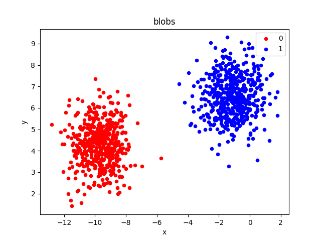
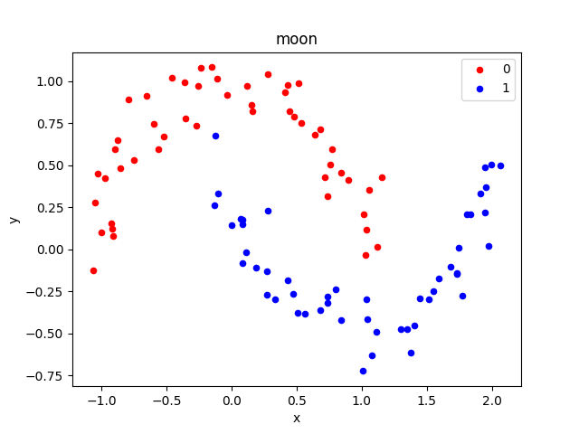
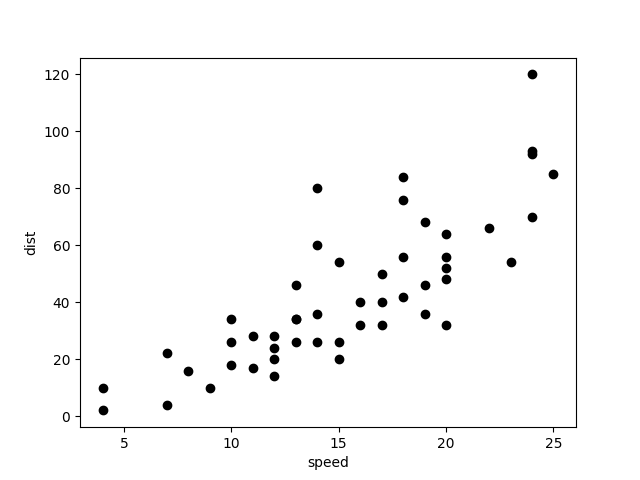
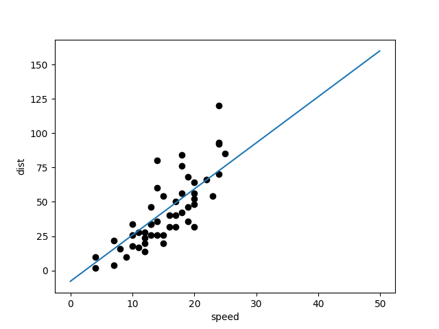
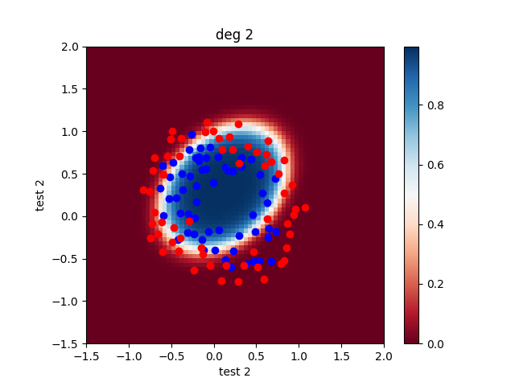
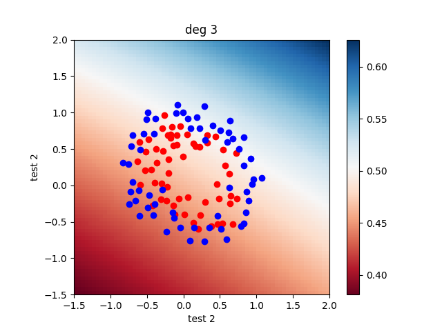
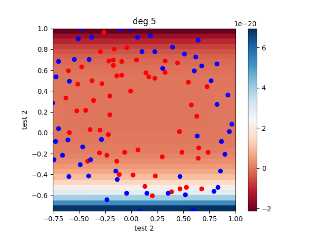
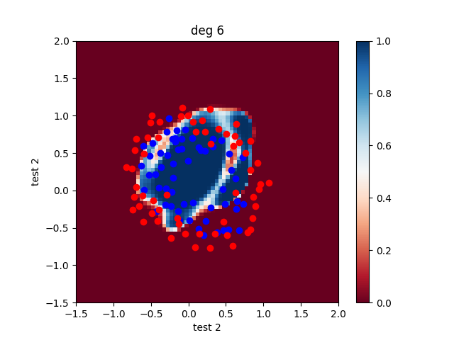
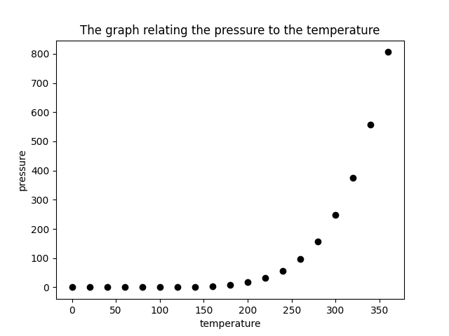

<table>

  <tr>
    <td></td>
    <td></td>
    <td></td>
  </tr>
	
<tr>
    <td></td>
    <td></td>
    <td></td>
  </tr>
  <tr>
    <td></td>
    <td></td>
    <td></td>
  </tr>
  
  
 </table>
 
<!-- 
git add -A; git commit -m "moon" ; git push

https://towardsdatascience.com/10-gradient-descent-optimisation-algorithms-86989510b5e9

costs : typeerror-/problemName-AlgorithmName-nameofdata

TODO : change logistic fonction
		fix tp 4
-->
## Requirements
	The implementation of logistic regression based on Armadillo library

## Command line
	g++ main_exemple.cpp -o bin/exe -llapack -lblas -larmadillo

## Algorithms

# Perceptron 

# Adaline

# Pocket

# Gradient Descent

# Gradient Descent Stochastic

# Momentum
